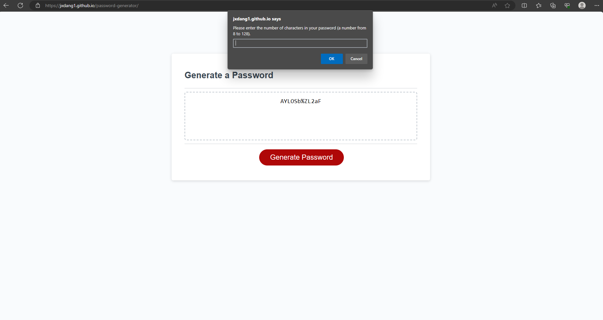

# password-generator

## Description

The goal of this project is to create a generated password randomly based on the user's criteria. The criteria includes but not limited to: numbers, symbols, uppercase letters, and lowercase letters. 

With JavaScript, I have created a series of prompts that will ask the user their desired length and type of characters for their password. With their choices, the generator selects the array that includes the user's desired type of character to be included into their password. Using a for loop, we use Math.floor() and Math.random() within the loop in order to have a random character be selected from the array of choice to be added to the new password until it reaches the desired length.

## Installation

N/A

## Usage

[Click here to view the project on GitHub pages.](https://jxdang1.github.io/password-generator/) Within the page, click the "Generate" button to generate a password after being asked the length of password and which characters you would like to be included in it.

Here is a screenshot of what the deployed page will look like with a generated password displayed on the website:

## Credits

This was a project made for the KU full stack coding bootcamp. The CSS, HTML, and some JavaScript were provided by them. In the comments, I have labeled what was provided. 

## License

Please see the license in the GitHub repo.